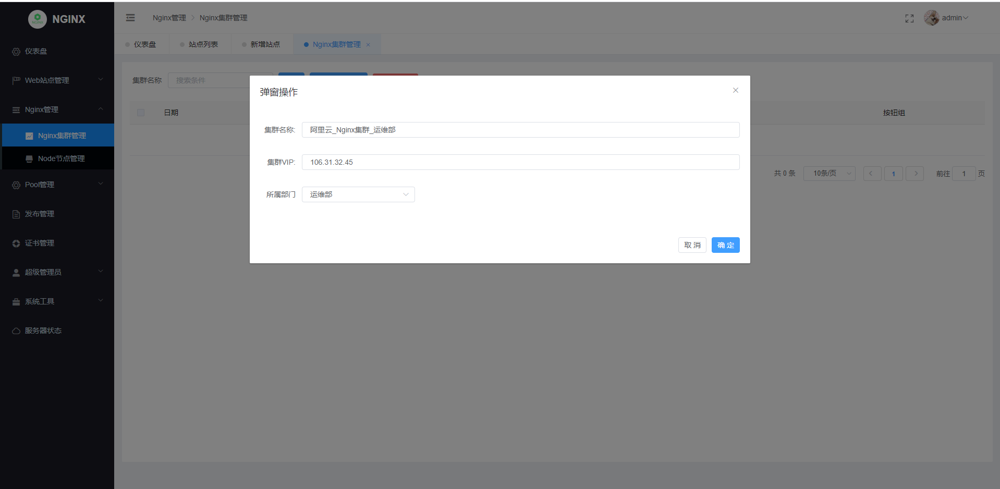
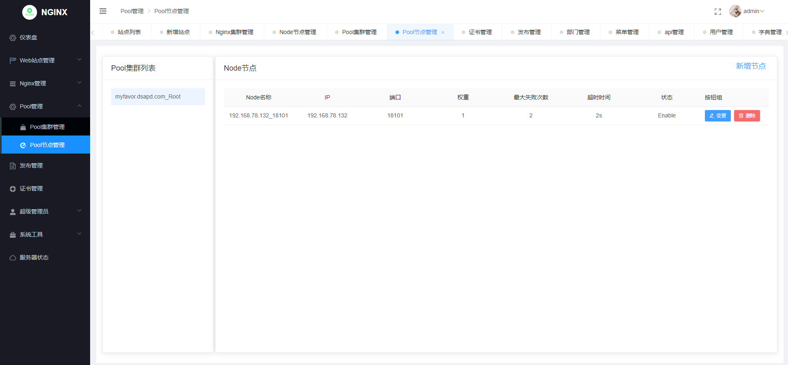
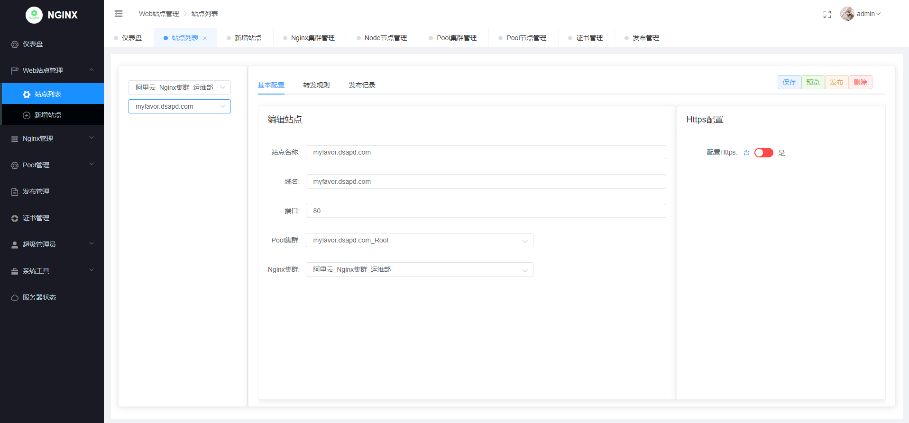
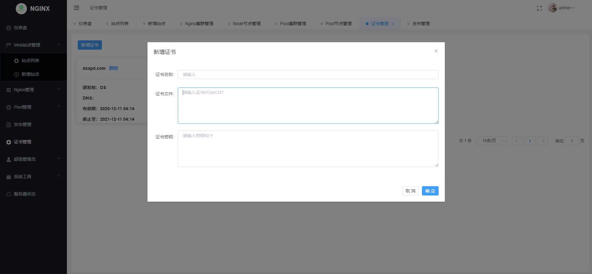
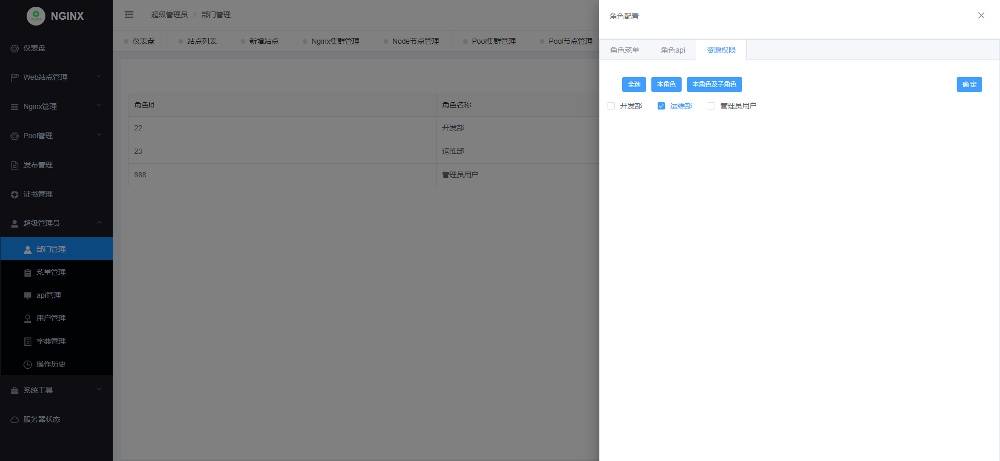

<h1 align="center">nginx-web</h1>

<div align="center">

nginx-web是轻量级无Agent的nginx集群配置管理平台，整合了Nginx集群管理、Pool管理、证书管理、Nginx域名配置发布等一系列功能。

</div>


## 特性

- **Nginx集群管理**: 管理Nginx集群及Nginx Node
- **Pool管理**: 管理Nginx Pool配置
- **站点管理**: Nginx站点配置修改和发布
- **证书管理**: Https证书管理
- **权限管理**: 支持分配用户的资源权限
- **开源免费**: 前后端代码完全开源


## 环境

* Go 1.14
* Node 12.16

## 安装
####Mysql 初始化
初始化文件：server/resource/init.sql (数据库需要支持utf8mb4)
```
CREATE DATABASE DBName  CHARACTER SET = 'utf8mb4'  COLLATE = 'utf8mb4_general_ci';
mysql -u user -p DBName < init.sql

默认登录账号admin/123456
```

####Server 安装
```
源码部署：
export GOPROXY=https://goproxy.io,direct
cd server
go build -o nginx-web .
nohup ./nginx-web &

二进制文件部署：
下载nginx-web.tar.gz文件
nohup ./nginx-web &
```

####Web 安装
```
npm部署：
npm run serve


nginx部署：
下载nginx_web.dist.zip 静态文件
默认nginx部署配置  server/resource/nginx/nginx_web.conf
```


####Config 修改
config.yaml
```
# Mariadb连接配置
mysql:
  path: 'IP:3306'
  config: 'charset=utf8mb4&parseTime=True&loc=Local'
  db-name: 'DBName'
  username: 'User'
  password: 'Passwd'
  max-idle-conns: 10
  max-open-conns: 100
  log-mode: false

# nginx服务器配置和证书保存路径(需要创建对应的目录)
nginx:
  config_path: "/etc/nginx/conf.d/"
  cert_path: "/etc/nginx/conf.d/cert/"

#server 配置
system:
  env: 'public'  # Change to "develop" to skip authentication for development mode
  addr: 8888
  db-type: 'mysql'
  oss-type: 'local'
  use-multipoint: false
  
# redis 配置(多点登录需要)
redis:
  db: 0
  addr: 'IP:6379'
  password: ''  
```

## 使用说明
```
1、编辑Nginx集群/Node
2、编辑SSL证书
3、新增Pool集群/Node
4、新增站点/发布 (保存、发布) 
5、查看发布记录
6、验证

Nginx站点配置模板文件: server/resource/nginx/nginx.conf.tpl
修改模板涉及的字段：http://127.0.0.1:8888/swagger/index.html  model.AutoConfigStruct
DockerFile还在修改中
```
## 推荐项目
[GIN-VUE-ADMIN](https://github.com/flipped-aurora/gin-vue-admin)
>感谢大佬的项目
## 预览

#### Nginx集群管理


#### Pool管理


#### 站点管理


#### 证书管理


#### 权限管理



  
## License & Copyright
[AGPL-3.0](https://opensource.org/licenses/AGPL-3.0)
